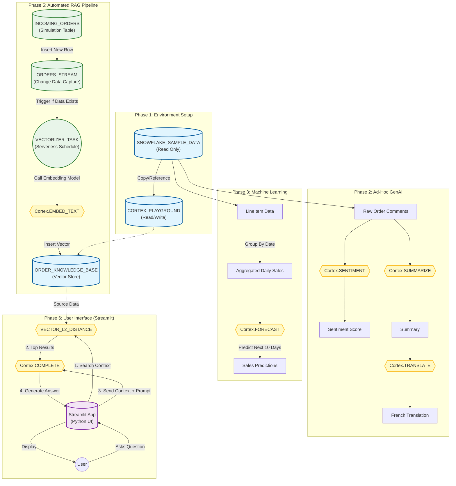

This flow diagram illustrates the end-to-end architecture you built, starting from the Environment Setup, moving through the ad-hoc AI/ML experiments, and finishing with the Automated RAG Pipeline and Streamlit Interface.

### **Detailed Architecture Flow**

### **Architecture Highlights**

1.  **Read-Only Source:** We successfully bridged the immutable `SNOWFLAKE_SAMPLE_DATA` by creating a "Playground" database to store our ML models and Vectors.
2.  **Serverless Compute:** Notice that **Cortex Functions** (Yellow nodes) handle the heavy lifting (Sentiment, Forecast, Embedding, Generation) without you managing GPU instances.
3.  **Event-Driven Architecture (Green Section):** The automation does not run on a rigid timer blindly; the **Task** checks the **Stream**. If no new orders arrive, the warehouse does not spin up, saving credits.
4.  **The "RAG Loop" (Purple Section):** The Streamlit app closes the loop by performing the "Retrieval" (Vector Distance) and "Generation" (Cortex Complete) in real-time based on the vectors created by your automated pipeline.